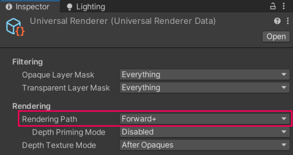

# Forward+ Rendering Path

The Forward+ Rendering Path lets you avoid the per object limit of the Forward Rendering Path.

The Forward+ Rendering Path has the following advantages compared with the Forward Rendering Path:

* There is no per-object limit for the number of Lights that affect GameObjects, the [per-Camera limit still applies](../urp-universal-renderer.md#real-time-lights-limitations). This implementation lets you avoid splitting big meshes when more than 8 lights affect them.

* Blending of more than 2 reflection probes.

* Support for multiple Lights when using Unity Entity Component System (ECS).

* More flexibility with procedural draws.

For more information, also check: [Rendering Path comparison](../urp-universal-renderer.md#rendering-path-comparison).

## How to select the Forward+ Rendering Path

To select the Forward+ Rendering Path, use the property **Rendering** > **Rendering Path** in the URP Universal Renderer asset.

When you set the Rendering Path to Forward+, Unity ignores the values in the following properties in URP Asset, **Lighting** section:
* **Main Light**. With Forward+ the value of this property is **Per Pixel** regardless of the value you select.

* **Additional Lights**. With Forward+ the value of this property is **Per Pixel** regardless of the value you select.

* **Additional Lights** > **Per Object Limit**. Unity ignores this property.

* **Reflection Probes** > **Probe Blending**. Reflection probe blending is always on.

## Limitations

The Forward+ Rendering Path has no limitations compared with the Forward Rendering Path.

## Reduce build time

Due to the wide variety of use cases, target platforms, renderers, and features used in projects, certain URP configurations can result in a large number of shader variants. That can lead to long compilation times.

Long shader compilation time affects both player build time and the time for a scene to render in the Editor.

The per-camera visible light limit value affects the compilation time for each **Lit** and **Complex Lit** shader variant. In the Forward+ Rendering Path, on desktop platforms, that limit is 256.

This section describes how to reduce the shader compilation time by changing the default maximum per-camera visible light count.

### Change the maximum number of visible lights

> [!NOTE]
> This instruction describes a workaround for a limitation in the URP design. This limitation will be mitigated in one of the future Unity versions.

The [Universal Render Pipeline Config package](../URP-Config-Package.md) contains the settings that define the number of maximum visible light. The following instructions describe how to change those settings.

> [!NOTE]
> If you upgrade the Unity version of your project, repeat this procedure.

1. In your project folder, copy the **URP Config Package** folder from `/Library/PackageCache/com.unity.render-pipelines.universal-config` to `/Packages/com.unity.render-pipelines.universal-config`.

2. Open the file `/com.unity.render-pipelines.universal-config/Runtime/ShaderConfig.cs.hlsl`.

    The file contains multiple definitions that start with `MAX_VISIBLE_LIGHT_COUNT` and end with the target platform name. Change the value in brackets to a suitable maximum in-frustum per-camera light count for your project, for example, `MAX_VISIBLE_LIGHT_COUNT_DESKTOP (32)`.

    For the **Forward+** Rendering Path, the value includes the Main Light. For the **Forward** Rendering Path, the value does not include the Main Light.

3. Open the file `/com.unity.render-pipelines.universal-config/Runtime/ShaderConfig.cs`.

    The file contains multiple definitions that start with `k_MaxVisibleLightCount` and end with the platform name. Change the value so that it matches the value set in the `ShaderConfig.cs.hlsl` file, for example `k_MaxVisibleLightCountDesktop = 32;`.

4. Save the edited files and restart the Unity Editor. Unity automatically configures your project and shaders to use the new configuration.

Now the Player build time should be shorter due to the reduced compilation time for each shader variant.
